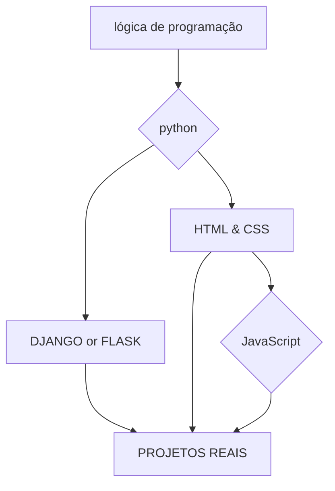

<h1 align="center">
  👋Olá! Eu sou o Brunno 👋  
  Back-end em formação  
  Brasil | 🇧🇷
</h1>

  

 

  
  
    
  
 

---

<section align="left">
  <h1> ✨sobre mim✨ </h1>
  

    Desde pequeno sempre tive paixão por tecnologia, e hoje estou realizando esse sonho podendo finalmente programar 
    e aprender mais desse vasto mundo tecnológico. Meu objetivo é estudar para conseguir condições melhores para mim 
    e para minha família. Atualmente estudando Python e HTML, com a meta de me tornar desenvolvedor back-end comprometido 
    em evoluir um pouco todos os dias.
  

</section>  

---

 <h2 align="center"> ⭐tecnologias⭐ </h2> 
  <ul>
    <li> python🐍 </li>
    <li> portugol🎨 </li>
    <li> HTML & CSS🌐 </li>
    <li> git & github✨ </li>
    <li> VS code🧩</li>
    <li> pycharm📊 </li>
  </ul>

---

---

<h1 align="center"> projetos mais relevantes   (atualizado sempre)</h1> 
 <ol> <li> <strong> landing-page-cards </strong> </li> <li> <strong> menu-interativo(portugol) </strong> </li> <li></li> </ol> </div

---

gmail:brunnoronaldo18@gmail.com
