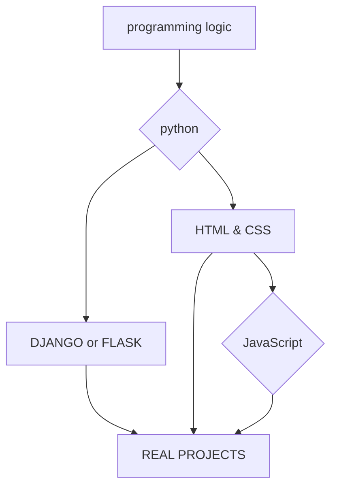

<h1 align="center">
  👋hi! i am Brunno 👋  
  Back-end in training  
  Brazil | 🇧🇷
</h1>

<h1 align="center">
  👋Olá! Eu sou o Brunno 👋  
  Back-end em formação  
  Brasil | 🇧🇷
</h1>

  

 

  
  
    
  
 

---

<section align="left">
   <h1> ✨about me✨ </h1>
  

   From a young age I've always had a passion for technology, and today I'm realizing that dream by finally being able to program
  and learn more about this vast technological world. My goal is to study to achieve better conditions for myself
  and my family. Currently studying Python and HTML, with the goal of becoming a committed back-end developer
  focused on improving a little every day.
  

  
  <h1> ✨sobre mim✨ </h1>
  

    Desde pequeno sempre tive paixão por tecnologia, e hoje estou realizando esse sonho podendo finalmente programar 
    e aprender mais desse vasto mundo tecnológico. Meu objetivo é estudar para conseguir condições melhores para mim 
    e para minha família. Atualmente estudando Python e HTML, com a meta de me tornar desenvolvedor back-end comprometido 
    em evoluir um pouco todos os dias.
  

</section>  

---

 <h2 align="center"> ⭐technologies⭐ </h2> 
  
  
  
  
  
  
  
  

<h2 align="center"> others </h2> 

  
  
  
  
  

---

---

<h1 align="center"> most relevant projects </h1> 

 
  <ol> 
    <li> <strong> https://github.com/brunnoronaldo-ti/MedWatch </strong> </li>
    <li> <strong> https://github.com/brunnoronaldo-ti/GitPulse </strong> </li>
    <li> <strong> https://brunnoronaldo-ti.github.io/adonay-site/ </strong></li> 
  </ol> 
</div

---

gmail:brunnoronaldo18@gmail.com
